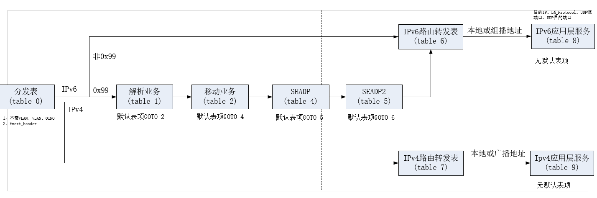

# SEANet网内解析App
> 依赖 onos ver-2.3.0 

### 流表处理流程图

### 配置文件参数说明

`SEANRS_TABLEID_IPV6` ：网内解析应用的流表ID，**默认为1**；带vlan的流表ID为默认流表ID+10；带Qinq标签的流表ID为默认流表ID+20（即1,11,21）

`MOBILITY_TABLEID_FOR_IPV6`：SEANet的默认移动性流表ID，**默认为2**，网内解析表的默认gotoTableID，同理如果是带vlan或者qinq Tag的需要在此ID基础上+10/+20。

`TABLESIZE`：流表项的数量，**默认为65536**

`IRS_NA_NAME`：解析单点的IPv6地址，需要保证控制器和解析单点之间的连通性，否则无法注册注销解析。

`IRS_PORT_NAME`：解析单点的服务端口号，一级为**10061**，二级为10062，三级为10063.

`BGP_NUM_NAME`：控制器所在控制域内的管理域BGP交换机的数量，**默认为1个**

`BGP_NA_NAME`：BGP交换机的IP地址，如果有多个的话以","分隔

### TODO LIST

- [ ]  (203, 82) **PacketProcessor** 的优先级要高，要在移动、组播、存储业务之前。具体数值待定

- [ ] (540, 37) .makePermanent() // TODO: 2021/8/20 这个地方后面要改成软超时，暂时先用永久表项

- [ ] (748, 16) // TODO: 2021/8/22 Vlan 和 Qinq 数据包暂时未特殊处理

- [ ] (804, 76) String BGP_NA = bgp_Na_List.get(0); // TODO: 2021/8/23 控制器给BGP发注册注销时暂时从BGP列表中选取选取第一个发送

- [ ] (827, 115) System.arraycopy(SocketUtil.hexStringToBytes("00"), 0, payload_format1, 1, 1); // TODO: 2021/8/25 假设"00"表示失败

- [ ] (870, 40) // 发送给解析单点解析请求 TODO: 暂时不支持tag解析

- [ ] (878, 67) // 解析成功!，将返回的NA的第一个填入ipv6的dstIP字段 TODO：**ip选择策略**

- [ ] (905, 28) // TODO: 2021/8/30 **解析到之后是否下发流表项，下发策略**？

- [ ] (892, 65) na = bgp_Na_List.get(0); // TODO: 2021/8/24 这里我**怎么知道哪个BGP**给我发的请求？